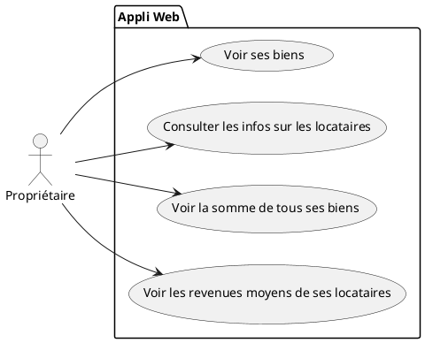

# Utilisation de l'application pour les proprios

Cas d'utilisation pour les proprios : 


## Prérequis
* L'application utilise NodeJs pour son serveur et Express et EJS pour les rendus côté navigateur. 
* L'API est générée avec Json-server
### Qui fait quoi ?
* index.js : gestion des routes et récupération des données de l'API
* dossier VIEWS : les vues 
* dossier public : fichiers accessibles par l'utilisateur
* db.json : l'API
  
#### Architecture
Client-serveur Node

```bash
public
views
    HomePage.ejs
    AppartPage.ejs
index.js
```
API Json server
```bash
db.json
```
## Les biens
### Routing
L'affichage de la liste des biens se fait sur la route /appartements. Cette route est configurable dans le fichier index.js qui se situe à la racine du projet.

```javascript
app.get("/appartements", (request, response) => {
    getApparts(object => {
        response.render("AppartPage", { object: object });
    })

});
```

Cette route dépend de la méthode GetApparts qui renvoie la liste à partir de l'API. 

```javascript
function getApparts(func) {
    fetch("http://localhost:3000/bien")
        .then(res => res.json()) /* les données json sont converties en objet Javascript */
        .then(res => {
            return func(res); /* Résolution de la Promise envoyée par json() */
        })
        .catch(err => {
            console.log(JSON.stringify(err));
        });
}
```

### Affichage
La vue AppartPage.ejs permet l'affichage côté navigateur. 

```html
 <% for(var i=0; i < object.length; i++) { %>
                <tr data-bs-toggle="tooltip" data-bs-html="true" data-bs-title="Voir les infos sur le locataire">

                    <td>
                        <%= object[i].id %>
                    </td>
                    <td>
                        <%= object[i].adresse %>
                    </td>
                    <td>
                        <%= object[i].loyer %>
                    </td>
                    <td>
                        <%= object[i].prix %>
                    </td>
                    <td>
                        <a href="/locataire/<%= object[i].locataire_id %>">Voir les infos de location</a>

                    </td>
                
                <% } %>
```


